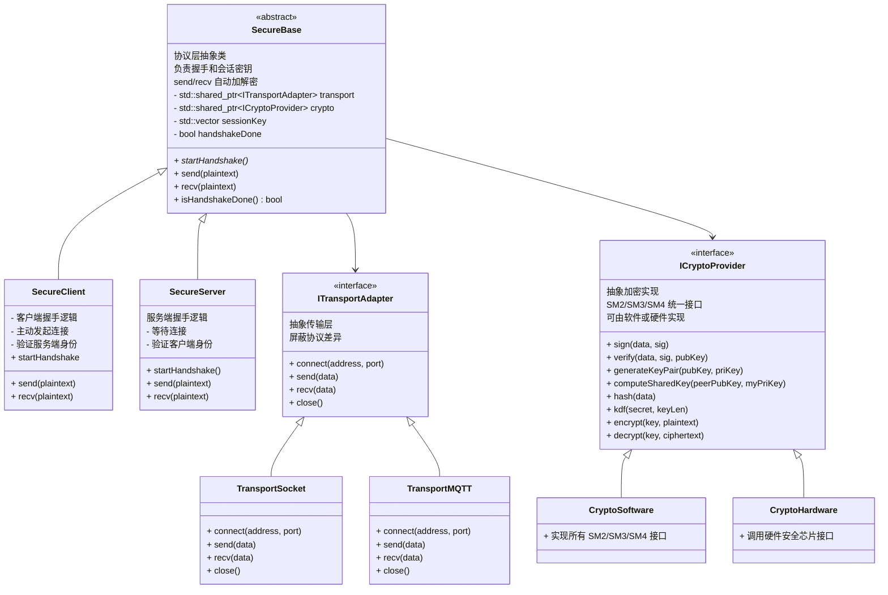
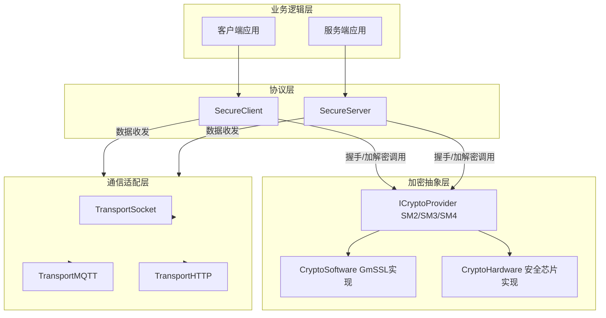
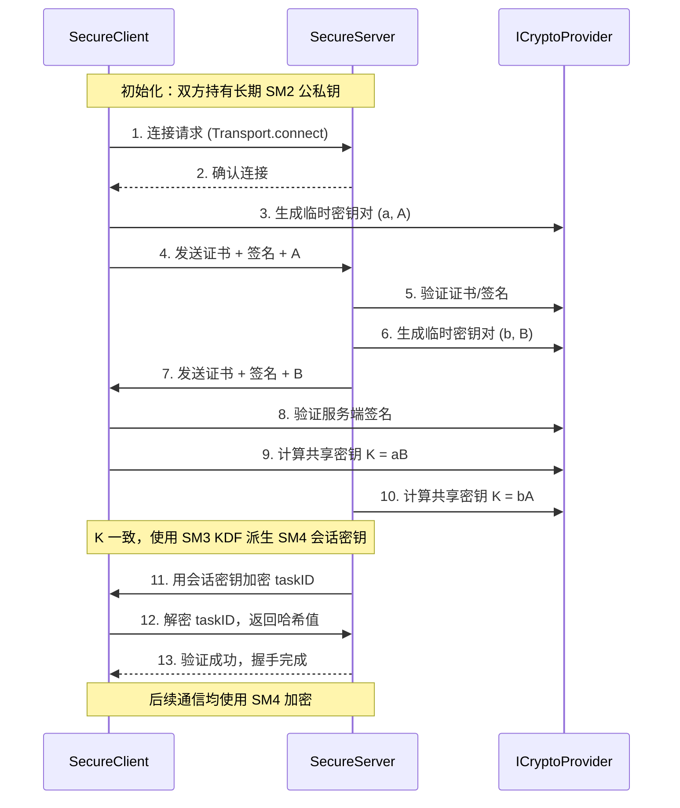
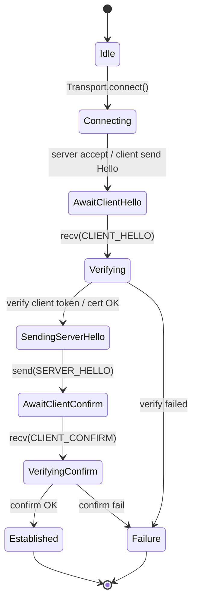

# 高安全通信框架设计文档

## 1. 设计原则
- **分层解耦**：通信层与加密实现层解耦，互不依赖
- **软硬件兼容**：软件实现可模拟，硬件可切换
- **协议独立**：安全握手与通信协议无关，支持 socket/mqtt/http
- **接口式编程**：通过抽象类定义接口，保证可扩展性和可维护性

---

## 2. 文件结构

```txt
secure_comm/
│
├── include/
│ ├── comm/                     # 通信层
│ │   ├── ITransportAdapter.h
│ │   ├── TransportSocket.h
│ │   └── TransportMQTT.h
│ │
│ ├── crypto/                   # 加密抽象层
│ │   ├── ICryptoProvider.h     # 通用接口（SM2/SM3/SM4）
│ │   ├── CryptoSoftware.h      # gmssl 软件实现
│ │   └── CryptoHardware.h      # 安全芯片实现
│ │
│ └── protocol/               # 协议层
│   ├── SecureBase.h          # 公共逻辑
│   ├── SecureClient.h        # 客户端逻辑
│   ├── SecureServer.h        # 服务端逻辑
│   └── HandshakeContext.h    # 握手状态上下文
├── src/
│ ├── comm/...
│ ├── crypto/...
│ └── SecureComm.cpp
│
├── tests/
│ ├── test_handshake.cpp
│ ├── test_transport.cpp
│ └── test_crypto.cpp
│
└── CMakeLists.txt
```

---

# 3 .核心接口设计
## 3.1 Transport 通信适配接口
负责底层数据传输，屏蔽具体协议（Socket/MQTT/HTTP）。
```cpp
// ITransportAdapter.h
class ITransportAdapter {
public:
    virtual bool connect(const std::string& address, int port) = 0;
    virtual bool send(const std::vector<uint8_t>& data) = 0;
    virtual bool recv(std::vector<uint8_t>& data) = 0;
    virtual void close() = 0;
    virtual ~ITransportAdapter() {}
};

```
- TransportSocket: 基于 TCP/UDP 实现
- TransportMQTT: 基于 MQTT 实现
- TransportHTTP: 基于 HTTP(S) 实现

## 3.2 CryptoProvider 加密算法抽象层
统一封装 SM2/SM3/SM4 接口，支持软件实现（gmssl）或硬件实现（安全芯片）。
```cpp
// ICryptoProvider.h
class ICryptoProvider {
public:
    // --- SM2 (签名/验证/密钥交换) ---
    virtual bool sign(const std::vector<uint8_t>& data, std::vector<uint8_t>& signature) = 0;
    virtual bool verify(const std::vector<uint8_t>& data, const std::vector<uint8_t>& signature,
                        const std::vector<uint8_t>& pubKey) = 0;
    virtual bool generateKeyPair(std::vector<uint8_t>& pubKey, std::vector<uint8_t>& priKey) = 0;
    virtual bool computeSharedKey(const std::vector<uint8_t>& peerPubKey,
                                  const std::vector<uint8_t>& myPriKey,
                                  std::vector<uint8_t>& sharedKey) = 0;

    // --- SM3 (哈希 / KDF) ---
    virtual std::vector<uint8_t> hash(const std::vector<uint8_t>& data) = 0;
    virtual std::vector<uint8_t> kdf(const std::vector<uint8_t>& secret, size_t keyLen) = 0;

    // --- SM4 (对称加解密) ---
    virtual std::vector<uint8_t> encrypt(const std::vector<uint8_t>& key,
                                         const std::vector<uint8_t>& plaintext) = 0;
    virtual std::vector<uint8_t> decrypt(const std::vector<uint8_t>& key,
                                         const std::vector<uint8_t>& ciphertext) = 0;

    virtual ~ICryptoProvider() {}
};
```
实现类：
- CryptoSoftware → 调 gmssl
- CryptoHardware → 调安全芯片驱动
## 3.3 SecureBase 协议层（握手/通信逻辑）
抽象公共逻辑，客户端/服务端继承。
```cpp
// SecureBase.h
class SecureBase {
protected:
    std::shared_ptr<ITransportAdapter> transport;
    std::shared_ptr<ICryptoProvider> crypto;

    std::vector<uint8_t> sessionKey;  // 会话密钥
    bool handshakeDone = false;

public:
    SecureBase(std::shared_ptr<ITransportAdapter> t, std::shared_ptr<ICryptoProvider> c)
        : transport(t), crypto(c) {}

    virtual bool startHandshake() = 0; // 握手流程 (client/server 不同)
    virtual bool send(const std::vector<uint8_t>& plaintext) = 0;
    virtual bool recv(std::vector<uint8_t>& plaintext) = 0;

    bool isHandshakeDone() const { return handshakeDone; }
    virtual ~SecureBase() {}
};

```

## 3.4 SecureClient & SecureServer
分别实现客户端/服务端的握手逻辑。

```cpp
// SecureClient.h
class SecureClient : public SecureBase {
public:
    SecureClient(std::shared_ptr<ITransportAdapter> t, std::shared_ptr<ICryptoProvider> c)
        : SecureBase(t, c) {}

    bool startHandshake() override;  
    bool send(const std::vector<uint8_t>& plaintext) override;
    bool recv(std::vector<uint8_t>& plaintext) override;
};

// SecureServer.h
class SecureServer : public SecureBase {
public:
    SecureServer(std::shared_ptr<ITransportAdapter> t, std::shared_ptr<ICryptoProvider> c)
        : SecureBase(t, c) {}

    bool startHandshake() override;  
    bool send(const std::vector<uint8_t>& plaintext) override;
    bool recv(std::vector<uint8_t>& plaintext) override;
};
```

## 5.类图


## 6.架构图


## 7. 顺序图


## 8. 开发/集成建议

### 8.1. 先软件实现：用 gmssl 模拟 SM2/SM3/SM4 全流程
### 8.2. 单元测试：验证握手流程、SM4 密钥一致性
### 8.3. 硬件适配：实现硬件 IAuth / IKeyExchange，支持自动切换
### 8.4. 多协议适配：TransportAdapter 支持 socket/mqtt/http
### 8.5. 文档化：每个接口类注释用途、输入输出、异常情况
### 8.6. 安全注意：
    - 临时私钥生成后尽快销毁
    - 会话密钥派生只用 KDF，不直接用原始 DH 点
    - 防止中间人，签名覆盖握手上下文信息

### 8.7. 握手与连接管理
- 握手失败处理
    - 建议服务端在握手失败时，立即断开该客户端连接，并记录错误日志。
    - 可在协议层区分失败原因（签名验证失败 / 会话密钥不同 / 超时），便于排查问题。
- 会话管理
    - 每个客户端 ID 维护一个会话密钥，并设定超时时间（推荐 1 小时或更短）。
    - 服务端定时清理过期会话，客户端需重新握手。
    - 好处：防止长期使用同一个密钥带来风险（降低被暴力破解概率）。

### 8.8. 日志与调试
- 错误日志必须保留，尤其是以下关键点：
    - 握手失败的阶段（例如验证失败、KDF 不一致）
    - 客户端 ID 和时间戳
    - 内存分配/释放异常
- 安全要求：日志中避免打印明文密钥或敏感数据，只打印错误码、上下文信息。
- 调试模式与生产模式分离：在 Debug 下允许输出更多信息，在 Release 下只保留必要的错误码。

### 8.9. 性能与压力测试

- 服务端性能监控
    - 服务端使用纯软件实现（gmssl），需重点关注 CPU 和内存占用。
    - 建议使用工具进行压测（如 wrk / locust / 自研测试脚本），模拟大量客户端同时握手与通信。
- 优化点
    - 可开启线程池 / 连接池，提高并发能力。
    - 如果瓶颈明显，可以考虑服务端引入硬件加速卡或迁移到 CryptoHardware 实现。

### 8.10 协议版本管理
协议版本号：在握手消息中增加 version 字段，例如：
```json
{
    "version": 1,
    "client_id": "abc123",
    "ephemeral_pubkey": "...",
    "signature": "..."
}
```
- 意义：
    - 避免未来修改握手流程时，客户端与服务端出现兼容性问题。
    - 如果未来需要升级算法（例如从 SM2 → SM9），只需 bump version，同时保留旧版本支持，做到平滑过渡。
    - 方便 OTA 升级后，客户端和服务端能协商正确的版本。

### 8.11 OTA 与统一通信框架
- 可行性：OTA（软件包更新）完全可以走同一个安全通信框架。
- 优势：
    - 不需要额外开发新的加密机制，复用已有的握手与会话密钥体系。
    - 传输大文件时可以分片，逐段使用 SM4 加密传输，确保完整性和安全性。
    - 服务端可以对 OTA 包再额外签名（SM2），客户端验证签名后写入存储，保证软件源头可信。
- 建议：OTA 下载应当有 断点续传机制，并在完成后对整体包做哈希校验（SM3），避免中途被篡改。

### 8.12 具体编码建议
- 针对重放攻击，要扔掉别人录制的重复的请求消息。
- 为了客运卫星需要监控和可监控性，需要一个ILogger抽象接口，日志需要脱敏
- 服务端和客户端的握手流程需要用状态机来实现，需要处理各种异常情况


## 9. 风险缓解、协议细化与可执行补充

下面补充一些必须落地的细节，便于直接实现并减少集成风险：握手状态机、消息格式、错误码、密钥生命周期、并发与资源限制、内存安全。

### 9.1 握手状态机（必须实现，带超时/重试策略）



实现要点：
- 每条连接维护握手状态和超时计时器；
- 对于客户端：主动在 Connecting 状态发起 CLIENT_HELLO 后等待 N 秒；超时重试上限为 2 次，超过断开并记录日志；
- 对于服务端：对未完成握手的连接设置并发上限（见 9.4）；未在超时时间内完成验证则立即断开。

### 9.2 报文与 JSON 字段规范（示例）

协议层使用长度前置（4 字节网络字节序 uint32_t）+ JSON（UTF-8）作为消息帧，JSON 字段示例：

1) CLIENT_HELLO

```json
{
    "version": 1,
    "type": "CLIENT_HELLO",
    "client_id": "device-001",
    "nonce": "base64(12bytes)",
    "ephemeral_pub": "hex(04...)",
    "cert": "base64(...)",        
    "signature": "hex(...)"      
}
```

字段说明：
- version: 协议版本号；
- nonce: 防重放随机数（推荐 12 字节），服务端应记录最近窗口以防重放；
- ephemeral_pub: 临时公钥（未压缩或带 0x04 前缀需在实现中统一）；
- cert: 可选设备证书（base64）或证书指纹；
- signature: 对 (client_id|nonce|ephemeral_pub|version) 的长期私钥签名（hex 或 base64）。

2) SERVER_HELLO

```json
{
    "version": 1,
    "type": "SERVER_HELLO",
    "server_id": "auth-01",
    "nonce": "base64(12bytes)",
    "ephemeral_pub": "hex(04...)",
    "cert": "base64(...)",
    "signature": "hex(...)"
}
```

3) CLIENT_CONFIRM

```json
{
    "version": 1,
    "type": "CLIENT_CONFIRM",
    "client_id": "device-001",
    "mac": "hex(...)"   
}
```

说明：mac 字段为使用派生会话密钥对上一步解密/验证数据的 MAC（建议 SM3-HMAC 或 SM4-CMAC），用于密钥一致性证明。

4) ERROR / CLOSE

```json
{
    "version": 1,
    "type": "ERROR",
    "code": 201,
    "message": "signature verification failed"
}
```

### 9.3 错误码与日志策略

建议一套通用错误码：
- 100 成功
- 200 握手错误通用
- 201 签名/证书验证失败
- 202 非法报文或解析失败
- 203 重放检测触发
- 204 超时
- 205 内部错误

日志策略：
- 错误日志保留 code、client_id、阶段、时间戳，不打印敏感数据；
- Debug 模式输出更详细但应避免私钥/明文数据；
- 对连续失败的 client_id 计数并在达到阈值后触发速率限制或短期封禁。

### 9.4 并发、资源限制与 DoS 缓解

- 最大并发连接数（全局）: configurable，例如 500；
- 最大未完成握手连接数: configurable，例如 100；超过上限的连接直接拒绝或排队；
- 对握手请求实行 token-bucket 限速（每秒允许 X 个新握手）；
- 对快速失败的 IP/client_id 实施短期黑名单（例如 60 秒）。

实现建议：服务端使用固定大小线程池/协程池处理握手，握手任务队列有最大长度，超过即拒绝。

### 9.5 密钥与证书生命周期管理

- 长期密钥：应有 key_id 并记录生成时间，支持平滑切换（先发布新公钥，双方支持旧+新）；
- 证书/公钥撤销：对于内网可使用短有效期证书（例如 7 天）或内置撤销列表；对于公网可考虑 OCSP/CRL；
- 密钥轮换流程：
    1. 生成新密钥对并验证（离线或通过管理接口）；
    2. 在配置中上线新公钥（server/client 同步）；
    3. 双向支持旧公钥一段时间（回退窗口），然后下线旧公钥；

### 9.6 内存安全与敏感数据处理

- 对私钥/会话密钥使用受控缓冲区并在使用后立即清零（memset_s 或等价）；
- 避免将敏感数据写入日志或持久化存储；
- 在支持的平台上为敏感内存页设置不可换出（mlock），并在释放前清零；
- 在高级需求下，使用硬件安全模块（HSM）或安全芯片直接托管私钥操作，避免在进程内暴露私钥。

### 9.7 测试与度量（建议）

- 单元测试：对每个握手步骤建立模拟测试（正常/签名失败/重放/超时）；
- 集成测试：模拟高并发握手，验证服务端资源限制与黑名单行为；
- 指标：握手成功率、握手平均时延、活跃会话数、每日握手失败次数（按错误码分类）。

### 9.8 小结与优先任务

短期（P0）建议立刻补充并实现：
1. 握手状态机实现（包含超时、重试、清理）
2. 报文字段与长度前缀规范（便于跨语言实现）
3. 基本错误码表与日志脱敏规则

中期（P1）:
1. 并发/资源限制实现与压力测试
2. 密钥轮换与撤销流程文档化

后期（P2）:
1. 内存加锁/平台级敏感数据保护
2. HSM/安全芯片深度集成
