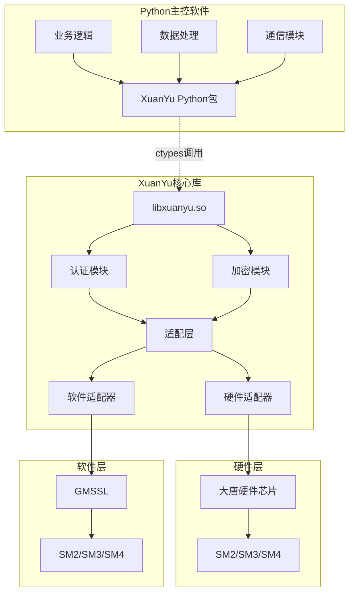
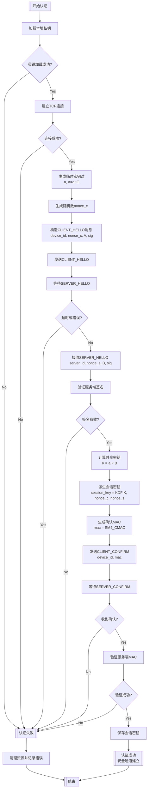
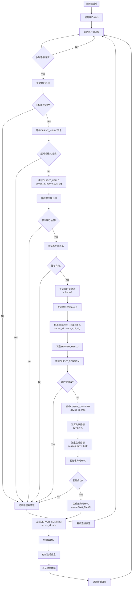
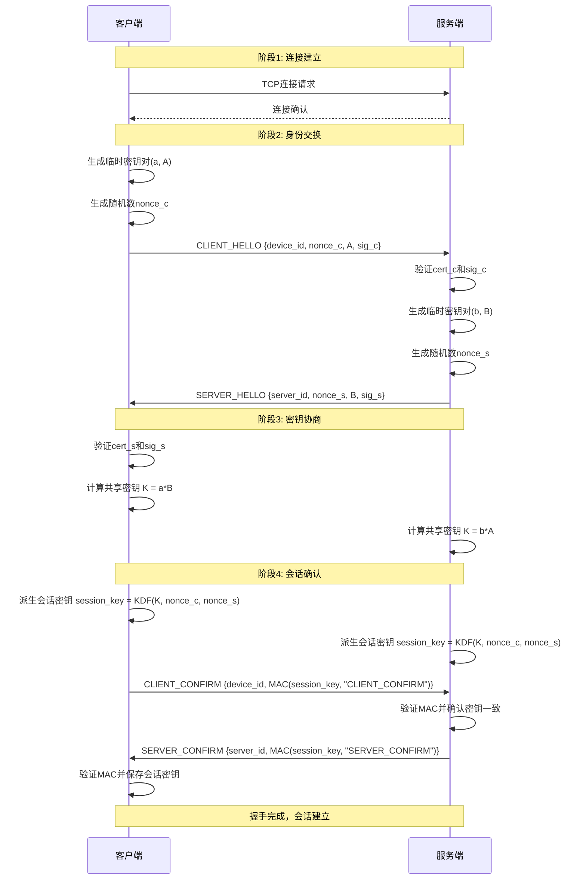
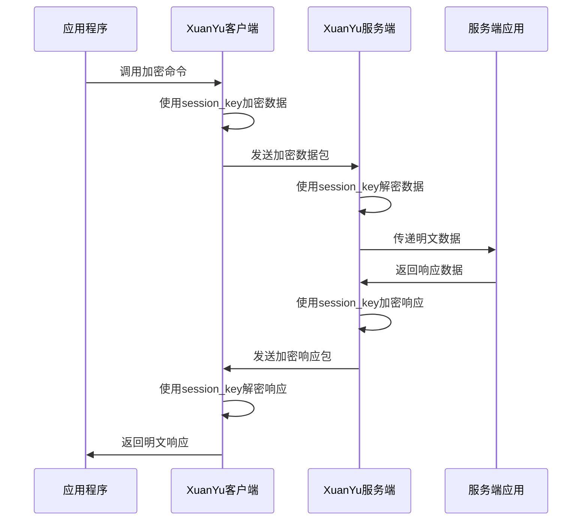

# XuanYu 高安全通信框架详细设计文档

## **数学原理**:
  - 基于椭圆曲线离散对数问题(ECDLP)
  - 椭圆曲线方程:y² = x³ + ax + b (mod p)
  - 国密推荐曲线参数:p = 2²⁵⁶ - 2²²⁴ - 2⁹⁶ + 2⁶⁴ - 1
  - 基点G的阶n = FFFFFFFE FFFFFFFF FFFFFFFF 7203DF6B 61916AC6 09B54CDD 046502BE BB6FB71F
  
  **密钥对生成**:
  - 私钥d:随机数 1 ≤ d ≤ n-1
  - 公钥Q:Q = d × G (椭圆曲线点乘,不是矩阵点乘!)
  - 说明:× 表示标量乘法,即 d×G = G + G + ... + G (d次点加法)
  
  **SM2加密过程**:
  1. 发送方获得接收方的公钥Q
  2. 生成随机数k (1 ≤ k ≤ n-1)
  3. 计算椭圆曲线点 C1 = k × G (这是密文的第一部分,公开传输)
  4. 计算点 S = k × Q (利用接收方公钥,得到一个共享点)
  5. 从S点提取x坐标,通过密钥派生函数生成密钥流: t = KDF(S.x, klen)
  6. 计算密文数据: C2 = M ⊕ t (明文与密钥流异或)
  7. 计算完整性校验: C3 = SM3(S.x || M || S.y)
  8. 最终密文: C = C1 || C2 || C3
  
  **SM2解密过程**:
  1. 接收方收到密文C,解析为 C1 || C2 || C3
  2. 使用私钥d计算共享点: S = d × C1 = d × (k×G) = k × (d×G) = k × Q (与加密方算出的S相同!)
  3. 从S点提取x坐标,派生相同的密钥流: t = KDF(S.x, klen)
  4. 恢复明文: M = C2 ⊕ t
  5. 验证完整性: 检查 C3 是否等于 SM3(S.x || M || S.y)
  
  **为什么安全**:
  - 攻击者看到C1 = k×G和公钥Q = d×G,但无法计算出k或d (ECDLP困难问题)
  - 没有私钥d,就无法计算共享点S = k×Q,也就无法得到密钥流t
  - 即使截获所有公开信息,也无法解密C2
  
  **签名过程**:
  - r = (e + k×G.x) mod n, s = d⁻¹(k - r×d) mod n
  - 其中e是消息的SM3哈希值与目标

### 1.1 背景
在物联网和嵌入式系统中，设备间通信面临严重的安全威胁：
- **数据窃听**：明文通信容易被截获
- **身份伪造**：恶意设备可以冒充合法设备
- **数据篡改**：通信内容可能在传输过程中被修改
- **重放攻击**：攻击者重复发送截获的数据包

### 1.2 加密技术基础知识

#### 对称加密（SM4）
- **特点**：加密和解密使用相同的密钥
- **数学原理**：
  - 基于32轮Feistel网络结构
  - 使用4个8×8的S盒进行非线性变换：S(x) = SubBytes(x)
  - 线性变换：L(B) = B ⊕ (B <<< 2) ⊕ (B <<< 10) ⊕ (B <<< 18) ⊕ (B <<< 24)
  - 轮函数：F(X0,X1,X2,X3,rk) = X0 ⊕ T(X1 ⊕ X2 ⊕ X3 ⊕ rk)
  - 密钥扩展算法生成32个轮密钥：rk[i] = K[i+4] ⊕ T'(K[i+1] ⊕ K[i+2] ⊕ K[i+3] ⊕ CK[i])
- **优势**：速度快，适合大量数据加密，抗差分和线性密码分析
- **劣势**：密钥分发困难，双方必须事先共享密钥
- **应用**：用于会话期间的数据加密

#### 非对称加密（SM2）
- **特点**：使用公钥加密、私钥解密（或私钥签名、公钥验证）
- **数学原理**：
  - 基于椭圆曲线离散对数问题（ECDLP）
  - 椭圆曲线方程：y² = x³ + ax + b (mod p)
  - 国密推荐曲线参数：p = 2²⁵⁶ - 2²²⁴ - 2⁹⁶ + 2⁶⁴ - 1
  - 基点G的阶n = FFFFFFFE FFFFFFFF FFFFFFFF 7203DF6B 61916AC6 09B54CDD 046502BE BB6FB71F
  - 私钥d：随机数 1 ≤ d ≤ n-1
  - 公钥Q：Q = d × G（椭圆曲线点乘）
  - 加密：C = k×G, M' = M ⊕ KDF(k×Q)
  - 签名：r = (e + k×G.x) mod n, s = d⁻¹(k - r×d) mod n
- **优势**：无需事先共享密钥，支持数字签名，密钥长度相对较短
- **劣势**：速度慢，不适合大量数据
- **应用**：用于身份认证和密钥交换

#### 哈希算法（SM3）
- **特点**：将任意长度数据转换为固定长度摘要
- **数学原理**：
  - 基于Merkle-Damgård结构，输出256位摘要
  - 压缩函数：CF(V[i-1], B[i-1]) = V[i]
  - 消息扩展：W[j] = P1(W[j-16] ⊕ W[j-9] ⊕ (W[j-3] <<< 15)) ⊕ (W[j-13] <<< 7) ⊕ W[j-6]
  - 置换函数：P0(X) = X ⊕ (X <<< 9) ⊕ (X <<< 17), P1(X) = X ⊕ (X <<< 15) ⊕ (X <<< 23)
  - 布尔函数：FF[j](X,Y,Z) = X ⊕ Y ⊕ Z (0≤j≤15), X&Y | X&Z | Y&Z (16≤j≤63)
  - 常数：T[j] = 0x79CC4519 (0≤j≤15), 0x7A879D8A (16≤j≤63)
- **优势**：不可逆，抗碰撞性强，微小变化导致完全不同的摘要
- **应用**：数据完整性校验、数字签名、HMAC计算

### 1.3 项目目标
设计一个基于国密算法（SM2/SM3/SM4）的高安全通信框架，实现：
1. **设备身份认证**：确保通信双方身份可信
2. **密钥安全交换**：动态生成会话密钥
3. **数据加密传输**：保护通信内容不被窃听
4. **防重放攻击**：确保数据包的新鲜性

### 1.4 Diffie-Hellman密钥交换与双向验证原理

#### 1.4.1 ECDH密钥交换数学原理
基于椭圆曲线的Diffie-Hellman密钥交换（ECDH）：

1. **密钥生成过程**：
   - 客户端生成临时密钥对：(a, A = a×G)
   - 服务端生成临时密钥对：(b, B = b×G)
   - 共享密钥计算：K = a×B = b×A = ab×G

2. **数学安全性**：
   - 攻击者获得A、B、G，但无法计算出a、b
   - 基于椭圆曲线离散对数困难问题：已知A=a×G，求解a在计算上不可行
   - 即使截获所有公开信息，也无法推导出共享密钥K

#### 1.4.2 双向身份验证的好处

1. **防止中间人攻击**：
   - 单向验证只验证服务端身份，客户端可能被伪造
   - 双向验证确保通信双方都是可信实体
   - 攻击者无法同时伪造客户端和服务端证书

2. **增强的安全保证**：
   - **身份确认**：每一方都能确信对方的真实身份
   - **不可否认性**：通信双方无法否认参与了通信
   - **完整性保护**：消息在传输过程中未被篡改
   - **机密性保障**：只有授权的通信方能解密消息

3. **攻击防护能力**：
   - **中间人攻击**：攻击者无法同时获得双方的私钥和证书
   - **重放攻击**：使用时间戳和随机数确保消息新鲜性
   - **会话劫持**：动态生成的会话密钥使劫持变得无意义
   - **身份伪造**：基于PKI体系的证书验证防止身份伪造

4. **实际应用价值**：
   - **零信任网络**：符合"永不信任，始终验证"的安全原则
   - **合规要求**：满足金融、军工等行业的双向认证要求
   - **供应链安全**：确保设备固件和通信的端到端安全
   - **物联网安全**：为大规模设备部署提供可扩展的安全架构

## 2. 系统整体功能

### 2.1 对外表现功能
从用户角度看，系统提供以下能力：

1. **设备认证**
   - 客户端向服务端证明自己的身份
   - 服务端验证客户端的合法性
   - 双向身份验证（可选）

2. **安全通信建立**
   - 自动协商生成会话密钥
   - 建立加密通信通道
   - 防止中间人攻击

3. **数据保护传输**
   - 发送数据自动加密
   - 接收数据自动解密
   - 数据完整性校验

### 2.2 系统架构选择：ctypes + Python包装方案



**架构优势**：
- **完全解耦**：Python主控软件通过标准库ctypes调用
- **性能优化**：核心加密逻辑用C++实现，性能更好
- **易于集成**：Python包装层提供友好的API接口
- **部署简单**：编译为.so库，pip安装Python包即可使用
- **跨语言支持**：C接口可被其他语言调用

## 3. 客户端功能设计

### 3.1 本地存储需求
客户端需要在本地存储以下信息：

```
~/.xuanyu/
├── config.json          # 配置文件
├── keys/
│   ├── device.key       # 设备长期私钥（SM2）
│   ├── device.pub       # 设备长期公钥（SM2）
│   └── session.key      # 当前会话密钥（SM4）
├── certs/
│   ├── device.cert      # 设备证书
│   └── ca.cert          # CA根证书
└── logs/
    └── xuanyu.log       # 操作日志
```

### 3.2 客户端API功能

#### 3.2.1 Python API接口
```python
import xuanyu

# 初始化客户端
client = xuanyu.Client(device_id="client001", config_path="~/.xuanyu")

# 与服务端进行认证握手，生成会话密钥
result = client.authenticate(server="192.168.1.100:8443")
if result.success:
    print(f"认证成功，会话ID: {result.session_id}")

# 加密数据
plaintext = "机密数据"
encrypted_data = client.encrypt(plaintext.encode())

# 解密数据
decrypted_data = client.decrypt(encrypted_data)
print(decrypted_data.decode())  # 输出: 机密数据
```

#### 3.2.2 底层C接口（ctypes调用）
```c
// 认证接口
int xuanyu_authenticate(const char* server, const char* device_id, char* session_id);

// 加密接口
int xuanyu_encrypt(const uint8_t* plaintext, size_t plain_len, 
                   uint8_t* ciphertext, size_t* cipher_len);

// 解密接口
int xuanyu_decrypt(const uint8_t* ciphertext, size_t cipher_len,
                   uint8_t* plaintext, size_t* plain_len);
```

**功能特点**：
- **Python友好**：提供面向对象的高级API
- **高性能**：底层C++实现，通过ctypes调用
- **易于集成**：直接在Python代码中import使用
- **错误处理**：完整的异常处理和错误码返回

### 3.3 客户端认证流程



## 4. 服务端功能设计

### 4.1 本地存储需求
服务端需要在本地存储以下信息：

```
/etc/xuanyu/
├── config.json          # 服务端配置
├── keys/
│   ├── server.key       # 服务端长期私钥（SM2）
│   ├── server.pub       # 服务端长期公钥（SM2）
│   └── ca.key           # CA私钥（用于签发设备证书）
├── certs/
│   ├── server.cert      # 服务端证书
│   ├── ca.cert          # CA根证书
│   └── clients/         # 客户端证书目录
│       ├── client001.cert
│       └── client002.cert
├── sessions/            # 会话密钥存储
│   ├── client001.session
│   └── client002.session
└── logs/
    └── server.log       # 服务端日志
```

### 4.2 服务端进程功能

#### 4.2.1 认证服务
```bash
# 启动认证服务
xuanyu-server --port 8443 --config /etc/xuanyu/config.json
```

**功能**：
- 监听客户端连接请求
- 处理认证握手协议
- 验证客户端证书和签名
- 生成并存储会话密钥
- 管理客户端会话

#### 4.2.2 会话管理
```bash
# 查看活跃会话
xuanyu-server --list-sessions
# 清理过期会话
xuanyu-server --cleanup-sessions
```

### 4.3 服务端认证流程



## 5. 认证流程详细设计

### 5.1 预备阶段：密钥和证书准备

**客户端需要**：
- 设备长期私钥（device.key）
- 设备证书（device.cert），由CA签发
- 服务端CA证书（ca.cert），用于验证服务端

**服务端需要**：
- 服务端长期私钥（server.key）
- 服务端证书（server.cert）
- CA私钥（ca.key），用于验证客户端证书
- 客户端证书列表或CA证书

### 5.2 握手协议流程



### 5.3 消息格式定义

#### CLIENT_HELLO
```json
{
    "version": 1,
    "type": "CLIENT_HELLO",
    "device_id": "client001",
    "nonce": "base64(随机数12字节)",
    "ephemeral_pub": "hex(临时公钥64字节)",
    "certificate": "base64(设备证书)",
    "signature": "hex(私钥签名64字节)"
}
```

**签名内容**：对(device_id + nonce + ephemeral_pub)的SM3哈希值进行SM2签名

#### SERVER_HELLO
```json
{
    "version": 1,
    "type": "SERVER_HELLO", 
    "server_id": "auth-server-01",
    "nonce": "base64(随机数12字节)",
    "ephemeral_pub": "hex(临时公钥64字节)",
    "certificate": "base64(服务端证书)",
    "signature": "hex(私钥签名64字节)"
}
```

#### CLIENT_CONFIRM
```json
{
    "version": 1,
    "type": "CLIENT_CONFIRM",
    "device_id": "client001",
    "mac": "hex(消息认证码32字节)"
}
```

**MAC计算**：使用会话密钥对"CLIENT_CONFIRM"字符串计算SM4-CMAC

## 6. 通信流程设计

### 6.1 加密通信流程

认证完成后，双方使用会话密钥进行加密通信：



### 6.2 数据包格式

**加密数据包结构**：
```
[4字节长度][16字节IV][N字节加密数据][32字节MAC]
```

- **长度**：网络字节序，表示后续数据总长度
- **IV**：SM4加密的初始化向量
- **加密数据**：使用SM4-CBC模式加密的原始数据
- **MAC**：使用会话密钥计算的SM3-HMAC，确保数据完整性

## 7. 错误处理和安全考虑

### 7.1 错误码定义
```
成功类:
  0: 操作成功

认证错误类 (100-199):
  101: 设备证书无效
  102: 签名验证失败
  103: 服务端证书无效
  104: 握手超时
  105: 重放攻击检测

通信错误类 (200-299):
  201: 连接失败
  202: 数据包格式错误
  203: 解密失败
  204: MAC验证失败

系统错误类 (300-399):
  301: 配置文件错误
  302: 密钥文件不存在
  303: 内存不足
  304: 文件操作失败
```

### 7.2 安全措施

#### 防重放攻击
- 使用时间戳和随机数nonce
- 服务端维护最近时间窗口内的nonce列表
- 拒绝重复的nonce

#### 会话管理
- 会话密钥定期更新（建议1小时）
- 检测异常断连，及时清理会话
- 限制每个设备的并发会话数

#### 密钥安全
- 私钥使用安全删除（内存清零）
- 会话密钥不写入磁盘（仅内存存储）
- 支持硬件安全模块（HSM）存储私钥

## 8. 部署和使用示例

### 8.1 初始化部署

#### 生成根证书和密钥
```bash
# 生成CA根密钥和证书
xuanyu-admin gen-ca --output ca.key --cert ca.cert

# 生成服务端密钥和证书
xuanyu-admin gen-server --ca-key ca.key --ca-cert ca.cert \
  --output server.key --cert server.cert --cn "auth-server"

# 生成客户端密钥和证书  
xuanyu-admin gen-client --ca-key ca.key --ca-cert ca.cert \
  --output client001.key --cert client001.cert --cn "client001"
```

#### 部署服务端
```bash
# 部署证书和密钥
sudo mkdir -p /etc/xuanyu/{keys,certs,sessions}
sudo cp server.key /etc/xuanyu/keys/
sudo cp server.cert ca.cert /etc/xuanyu/certs/

# 启动服务
sudo xuanyu-server --port 8443 --config /etc/xuanyu/config.json
```

#### 部署客户端
```bash
# 1. 安装XuanYu Python包
pip install xuanyu

# 2. 部署客户端证书
mkdir -p ~/.xuanyu/{keys,certs}
cp client001.key ~/.xuanyu/keys/device.key
cp client001.cert ~/.xuanyu/certs/device.cert
cp ca.cert ~/.xuanyu/certs/

# 3. Python代码中直接使用
# import xuanyu
# client = xuanyu.Client()
```

### 8.2 日常使用流程

#### 8.2.1 Python主控软件集成
```python
import xuanyu
import mqtt_client

# 1. 初始化XuanYu客户端
client = xuanyu.Client(device_id="client001")

# 2. 认证建立会话
auth_result = client.authenticate(server="192.168.1.100:8443")
if not auth_result.success:
    raise Exception(f"认证失败: {auth_result.error}")

# 3. 在现有MQTT通信中集成加密
def send_secure_message(topic, data):
    # 加密数据
    encrypted = client.encrypt(data.encode())
    # 通过现有MQTT发送
    mqtt_client.publish(topic, encrypted)

def receive_secure_message(topic, encrypted_data):
    # 解密接收到的数据
    decrypted = client.decrypt(encrypted_data)
    return decrypted.decode()

# 4. 使用示例
send_secure_message("/data/client001", "机密传感器数据")
```

#### 8.2.2 服务端集成
```python
import xuanyu

# 服务端同样使用Python API
server = xuanyu.Server(port=8443, config="/etc/xuanyu/config.json")
server.start()

# 处理客户端数据
def handle_client_data(client_id, encrypted_data):
    # 自动解密客户端数据
    plaintext = server.decrypt(client_id, encrypted_data)
    # 处理业务逻辑
    process_sensor_data(plaintext)
```

## 9. 性能和扩展性

### 9.1 性能指标
- **握手延迟**：目标 < 100ms（局域网）
- **加解密吞吐量**：目标 > 10MB/s（软件实现）
- **并发会话数**：目标支持1000个并发会话
- **内存占用**：目标 < 50MB（服务端进程）

### 9.2 扩展性设计
- **多服务端**：支持负载均衡和故障转移
- **证书管理**：集成LDAP/数据库进行证书管理
- **硬件加速**：支持硬件安全模块加速加解密
- **协议扩展**：预留版本号支持协议升级

这个设计文档提供了完整的技术实现路径，既有理论基础，又有具体的实现细节，适合在技术会议上进行讲解和讨论。