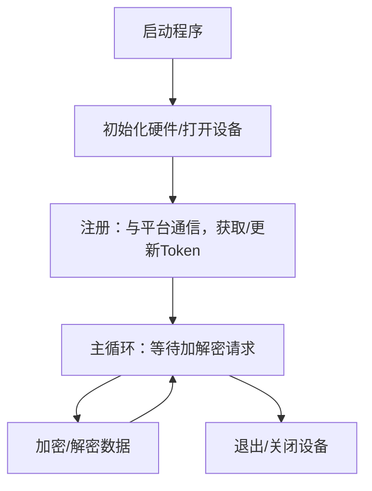
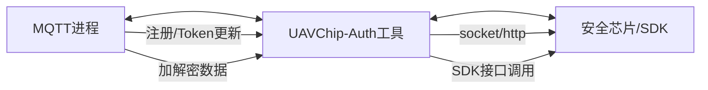

## 开发任务简明说明
主要价值是这里面有小板子对应的i2c的基本实现，以及完整的编译流程，CmakeList.txt和build.sh
### 1. 需要实现和调用的接口

#### 你需要实现：
- trans.c 里的硬件适配接口（如 Dmt_Device_Open, Dmt_Send_Data, Dmt_Recv_Data 等），用于主控与安全芯片通信。

#### 你需要调用：
- SDK 提供的高层接口（如注册、加密、解密），通常在 FuncLib.h 里声明。

### 2. 程序主流程图（mermaid）

### 3. 最小MVP demo测试建议

- 测试 Dmt_Device_Open / Dmt_Device_Close 是否能正常初始化和关闭硬件
- 测试注册流程（如 Token 获取与更新）
- 测试加密接口：输入明文和Token，输出密文
- 测试解密接口：输入密文和Token，输出明文

#### 测试方法建议：
- 用简单的 main.c，依次调用上述接口，打印每步结果
- 可用模拟数据或空实现先跑通流程，后续再接入真实硬件

---

这样可以保证你的开发目标明确，流程清晰，便于后续扩展和调试。

# UAVChip-Auth 设计文档

## 一、项目简介

UAVChip-Auth 是一个面向无人机安全芯片的独立二进制工具，主要实现注册、加密、解密三大核心功能。平台和无人机通过调用该工具，实现安全认证和数据加密传输，保障通信安全。

## 二、设计思路

### 1. 独立二进制 vs 进程间通信（socket）

- **独立二进制调用**
  - 优点：实现简单，易于集成到各种语言和系统环境；每次加解密时直接调用，资源隔离好，易于调试和部署。
  - 缺点：每次调用都需启动新进程，性能略低，频繁调用时开销较大。

- **进程间通信（socket）**
  - 优点：可复用进程，性能高，适合高频加解密场景；支持异步和批量处理。
  - 缺点：实现复杂，需要维护服务进程和连接状态；调试和部署略麻烦。

> 本项目优先采用独立二进制方式，后续可根据性能需求扩展为 socket 服务模式。

### 2. 核心流程

- **注册与Token管理**
  - 启动时，工具与平台进行注册，获取并更新 Token。
  - Token 的汇报和更新通过 socket 或 http 与平台通信，确保认证安全。

- **加解密功能**
  - MQTT 进程需要加解密时，调用本工具完成数据加密/解密。
  - 加密/解密均依赖安全芯片和 Token，保证数据安全。

- **启动接口**
  - 对外提供统一启动接口，自动完成注册、Token更新等流程，确保系统初始化后即可安全通信。

## 三、系统架构

## 四、主要接口说明

### 1. 注册接口
- 功能：与平台通信，获取/更新 Token
- 输入：设备ID、初始Token等
- 输出：注册结果、Token

### 2. 加密接口
- 功能：对外部数据进行加密
- 输入：明文数据、Token
- 输出：密文数据

### 3. 解密接口
- 功能：对收到的密文进行解密
- 输入：密文数据、Token
- 输出：明文数据

### 4. 启动接口
- 功能：一键完成注册、Token更新等初始化流程
- 输入：配置参数
- 输出：初始化结果

## 五、后续扩展建议

- 支持 socket 服务模式，提升高频加解密性能
- 支持多平台和多语言调用
- 增加日志和异常处理，便于运维和调试

---

如需详细接口参数和代码示例，可进一步补充。这个文档可以作为项目初期的设计说明和团队沟通基础。